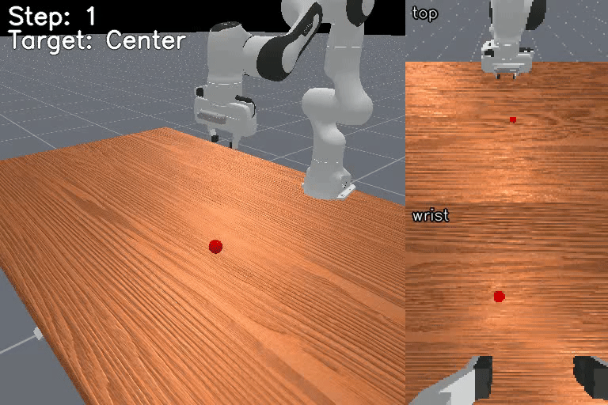
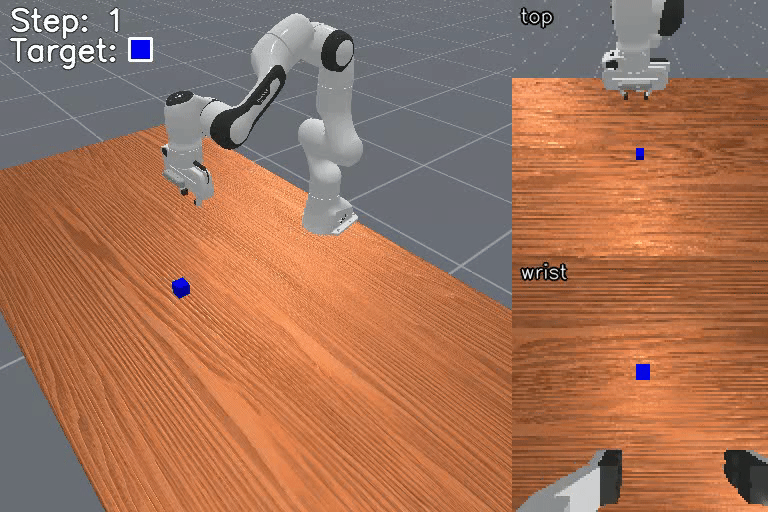
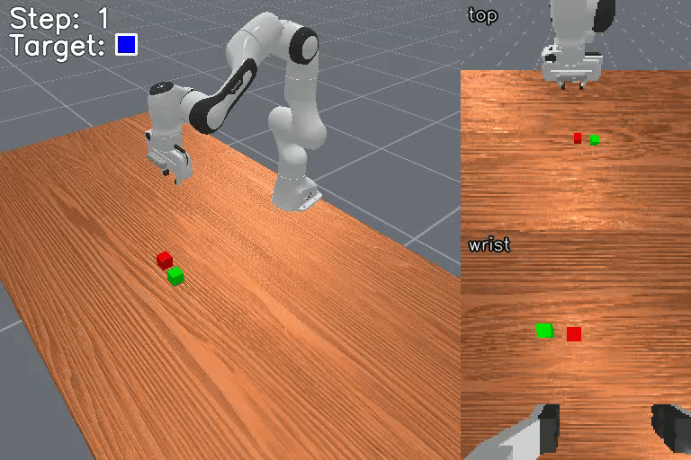
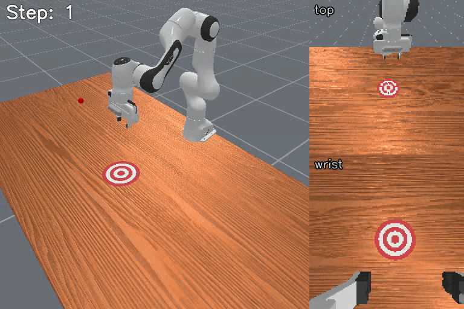
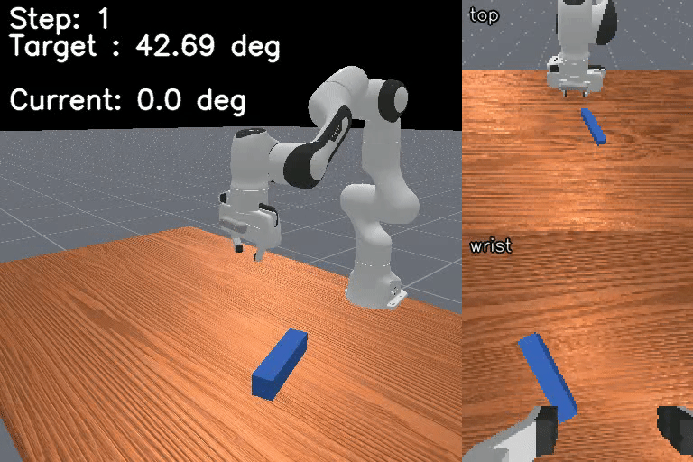
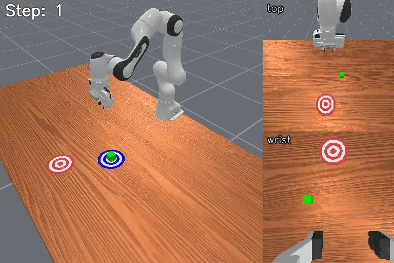

<h1 align="center">MIKASA-Robo-VLA</h1>

<p align="center">
  <b>A memory-intensive robotic manipulation benchmark for Vision-Language-Action research.</b>
</p>

<p align="center">
  <a href="https://mikasarobo.github.io/">
    
  </a>
  <a href="https://arxiv.org/abs/2502.10550">
    
  </a>
  <a href="https://huggingface.co/mikasa-robo">
    
  </a>
  <a href="https://pypi.org/project/mikasa-robo-suite/">
    
  </a>
</p>

<table align="center">
  <tr>
    <td align="center"><br><sub>Shell Game Touch</sub></td>
    <td align="center"><br><sub>Shell Game Shuffle Color Lamp Touch</sub></td>
    <td align="center"><br><sub>Remember Color</sub></td>
    <td align="center"><br><sub>Remember Shape &amp; Color</sub></td>
  </tr>
  <tr>
    <td align="center"><br><sub>Find Imposter Color</sub></td>
    <td align="center"><br><sub>Intercept</sub></td>
    <td align="center"><br><sub>Rotate Strict</sub></td>
    <td align="center"><br><sub>Take It Back</sub></td>
  </tr>
</table>

## What is MIKASA-Robo-VLA?

MIKASA-Robo-VLA extends the MIKASA-Robo memory benchmark to language-conditioned Vision-Language-Action research. It provides tabletop robotic manipulation environments that require an agent to retain and use information across delayed, occluded, temporal, or multi-stage interactions.

The canonical VLA benchmark contains **90 tasks** with natural-language instructions, ManiSkill/Gymnasium environments, and released trajectory datasets for training and evaluation. The benchmark task manifest is [`mikasa_robo_vla_envs.csv`](mikasa_robo_vla_envs.csv).

### What changed from MIKASA-Robo (RL release)

- **Task set grows from 32 → 90** registered environments covering **10 memory types** (vs 4 in the RL release).
- **Every task ships a natural-language `LANGUAGE_INSTRUCTION`** for VLA conditioning.
- **Episodes are grouped into three horizon splits** (Short / Medium / Long) so multi-task training and evaluation are tractable.
- **22,500 PPO / motion-planning oracle trajectories** are released on Hugging Face in RLDS and LeRobotDataset v3 formats — no further conversion needed (6+ million transitions).
- **Dense and normalised-dense rewards** are calibrated for every task, enabling both offline imitation learning and online RL.
- The original 32-task RL implementation is available from the [`mikasa-robo-rl` branch](https://github.com/CognitiveAISystems/MIKASA-Robo/tree/mikasa-robo-rl) and remains under `mikasa_robo_suite/rl/` for backwards compatibility.

> [!IMPORTANT]
> **For the complete benchmark reference, go to the documentation website:**
> ### 📚 [mikasarobo.github.io](https://mikasarobo.github.io/)
> It covers installation, all 90 tasks with descriptions, dataset format, API reference, training recipes, and usage examples.
> This README contains only a minimal setup summary.

> [!NOTE]
> Looking for the original RL-oriented **MIKASA-Robo**?
> - **Git:** [`mikasa-robo-rl` branch](https://github.com/CognitiveAISystems/MIKASA-Robo/tree/mikasa-robo-rl)
> - **PyPI:** `pip install mikasa-robo-suite==0.0.5`

## Installation

Install from the repository with the locked `uv` environment:

```bash
git clone https://github.com/CognitiveAISystems/MIKASA-Robo.git
cd MIKASA-Robo
uv sync --frozen
```

> [!TIP]
> The submodule (`utils/convert_npz_to_rlds/`) is only needed if you plan to **collect your own trajectory datasets** (`.npz`) and then **convert them to RLDS format**. For benchmarking, evaluation, or training on the released datasets, you can skip it. To initialize it when needed:
> ```bash
> git submodule update --init --recursive
> ```

See the [installation guide](https://mikasarobo.github.io/installation.html) for system requirements, package-install alternatives, and setup troubleshooting.

## Quick Start

Every benchmark environment should be wrapped with `apply_mikasa_vla_wrappers` immediately after `gym.make` so its observations and task logic match the released VLA data pipeline.

```python
import gymnasium as gym
import torch

import mikasa_robo_suite.vla.memory_envs  # registers VLA env IDs
from mikasa_robo_suite.vla.utils.apply_wrappers import apply_mikasa_vla_wrappers

env = gym.make(
    "RememberColor3-VLA-v0",
    num_envs=1,
    obs_mode="rgb",
    control_mode="pd_ee_delta_pose",
    reward_mode="normalized_dense",
    render_mode="all",
    sim_backend="gpu",
)
env = apply_mikasa_vla_wrappers(env, include_overlays=False)

obs, info = env.reset(seed=42)
for _ in range(env.max_episode_steps):
    action = torch.as_tensor(env.action_space.sample(), device=env.unwrapped.device)
    obs, reward, terminated, truncated, info = env.step(action)
    if torch.as_tensor(terminated | truncated).any():
        break

env.close()
```

For task browsing, wrapper behavior, language instructions, and the observation/action contract, use the [quick start](https://mikasarobo.github.io/quickstart.html), [environment catalogue](https://mikasarobo.github.io/vla_environments/index.html), and [observation/action reference](https://mikasarobo.github.io/observation_space.html).

## Benchmarking

Run the reference checkpoint-free dummy policy first to smoke-test the evaluation pipeline:

```bash
uv run python examples/eval_demo.py \
  --num-episodes 1 --sim-backend gpu \
  --output-dir eval_results/dummy
```

Canonical evaluation is organized by horizon split and uses the benchmark protocol for task selection, seeds, metrics, and result files. See [Benchmarking](https://mikasarobo.github.io/benchmarking.html) and the [Evaluation Protocol](https://mikasarobo.github.io/evaluation_protocol.html) before reporting results.

## Datasets

MIKASA-Robo-VLA provides the full 90-task trajectory release on Hugging Face. The data pipeline supports:

- **NPZ** source episodes for local collection and custom preprocessing.
- **RLDS / TFDS** for episodic dataset pipelines.
- **LeRobotDataset v3** for modern PyTorch and VLA fine-tuning workflows.

Download one LeRobotDataset task with `huggingface_hub`:

```python
from huggingface_hub import snapshot_download

snapshot_download(
    repo_id="mikasa-robo/mikasa-robo-vla-lerobot",
    repo_type="dataset",
    allow_patterns="remember_color_3_vla_v0/**",
    local_dir="data_mikasa_robo/data_lerobot",
)
```

`allow_patterns` matches paths inside the Hugging Face dataset repository.
LeRobot task directories use normalized lowercase dataset names, for example
`RememberColor3-VLA-v0` is stored as `remember_color_3_vla_v0/`. The downloaded
files are placed under `data_mikasa_robo/data_lerobot/remember_color_3_vla_v0/`.

The [dataset guide](https://mikasarobo.github.io/datasets.html) covers the public RLDS and LeRobot releases, local collection, dataset fields, and export workflows.

## Useful Links

- [Documentation](https://mikasarobo.github.io/)
- [Installation](https://mikasarobo.github.io/installation.html)
- [Quick Start](https://mikasarobo.github.io/quickstart.html)
- [Environments and Tasks](https://mikasarobo.github.io/vla_environments/index.html)
- [Benchmarking](https://mikasarobo.github.io/benchmarking.html)
- [Datasets](https://mikasarobo.github.io/datasets.html)

## Citation

If you use MIKASA-Robo-VLA in your research, please cite:

```bibtex
@inproceedings{cherepanov2026memory,
  title     = {Memory, Benchmark \& Robots: A Benchmark for Solving Complex Tasks with Reinforcement Learning},
  author    = {Egor Cherepanov and Nikita Kachaev and Alexey Kovalev and Aleksandr I. Panov},
  booktitle = {The Fourteenth International Conference on Learning Representations},
  year      = {2026},
  url       = {https://openreview.net/forum?id=9cLPurIZMj}
}
```
